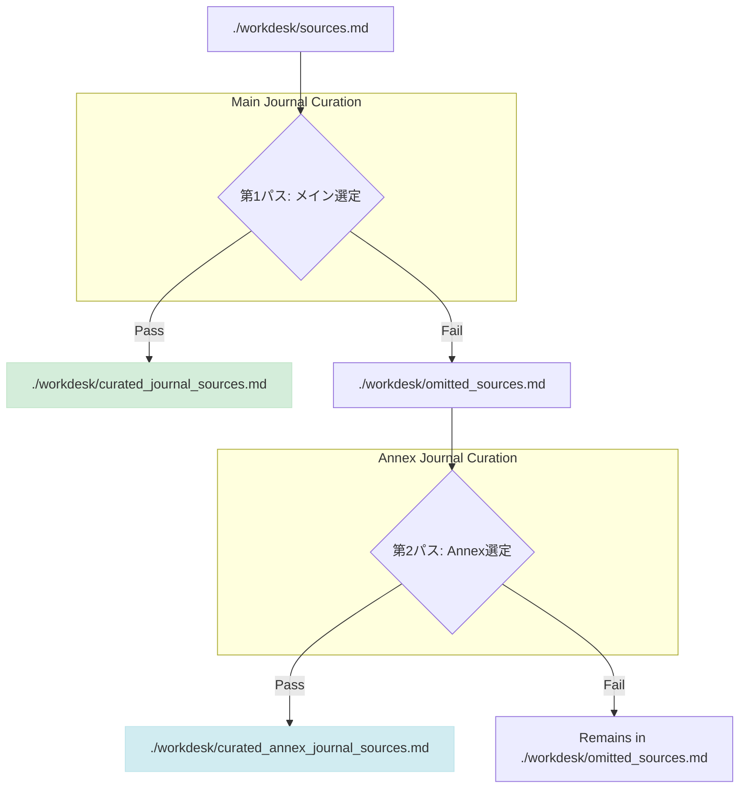

# ソース選定ワークフロー

本ドキュメントは、メインジャーナルおよびAnnexジャーナルの品質と一貫性を担保するための、ソース選定（キュレーション）プロセスを定義します。

**原則として、作業は全てリポジトリのルートディレクトリから行い、ファイルパスは `./workdesk/` のように明示します。**

---

## 選定プロセス

### Step 0: サマリーの統合

キュレーション作業の前に、個別のサマリーファイルを一つに統合します。

- **入力**: `./workdesk/summaries/*.md` (個別サマリー群)
- **コマンド**:
  ```bash
  awk 'FNR==1 && NR!=1 {print "\n\n---\n\n"} 1' ./workdesk/summaries/*.md > ./workdesk/unified_summaries.md
  ```
- **出力**: `./workdesk/unified_summaries.md` (統合サマリー)

---

### Step 1: 第1パス：メインジャーナルの選定

1.  **目的**: その週の最も重要で価値のある記事を、メインジャーナル向けに選定する。
2.  **入力**: 
    - `./workdesk/sources.md` (全ソースリスト)
    - `./workdesk/unified_summaries.md` (統合サマリー)
3.  **基準**: `curation_criteria.md`
4.  **アクション**:
    - **合格 (Pass)**: 基準を満たすURLを `./workdesk/curated_journal_sources.md` に追加する。
    - **不合格 (Fail)**: 基準を満たさないURLを `./workdesk/omitted_sources.md` に追加する。
5.  **出力**:
    - `./workdesk/curated_journal_sources.md` (メインジャーナル用ソース)
    - `./workdesk/omitted_sources.md` (Annexジャーナル候補)

---

### Step 2: 第2パス：Annexジャーナルの選定

1.  **目的**: メインから漏れたソースの中から、特定の読者層に深い洞察を提供する「B面」的な価値を持つ記事を選定する。
2.  **入力**: 
    - `./workdesk/omitted_sources.md` (Annexジャーナル候補)
    - `./workdesk/unified_summaries.md` (統合サマリー)
3.  **基準**: `annex_curation_criteria.md`
4.  **アクション**:
    - **合格 (Pass)**: 基準を満たすURLを `./workdesk/curated_annex_journal_sources.md` に追加する。その際、単にリンクを貼るだけでなく、**なぜこの記事がAnnexとして価値があるのか**、編集者としての短いコメント（日本語）を添える。
    - **不合格 (Fail)**: 基準を満たさない記事は `./workdesk/omitted_sources.md` に残す（記録のため）。
5.  **出力**:
    - `./workdesk/curated_annex_journal_sources.md` (Annexジャーナル用ソース)

---

## 関連ファイル一覧

- **作業ディレクトリ**: `./workdesk/`
- **基準定義**:
  - `curation_criteria.md`
  - `annex_curation_criteria.md`
- **入力ファイル**:
  - `./workdesk/sources.md`
  - `./workdesk/summaries/*.md`
- **中間生成ファイル**:
  - `./workdesk/omitted_sources.md`
- **最終成果物**:
  - `./workdesk/curated_journal_sources.md`
  - `./workdesk/curated_annex_journal_sources.md`
  - `./workdesk/unified_summaries.md`

---

## ワークフロー概要図

