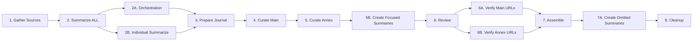

# GenAI Coding Journal

A weekly curated journal of AI and coding developments, featuring high-impact articles in the main journal and unique perspectives in the annex journal.

## Workflow Overview

This project follows a systematic workflow to create weekly journals:



## Workflow Steps

1. **[Gather Sources](STEP_01_GATHER_SOURCES.md)** - Collect URLs from structured GitHub issue with numbered IDs
2. **[Summarize](STEP_02_SUMMARIZE.md)** - Generate summaries for ALL sources
   - 2A. **[Orchestration](STEP_02A_ORCHESTRATION.md)** - Manage batch summarization process
   - 2B. **[Individual Summarize](STEP_02B_INDIVIDUAL_SUMMARIZE.md)** - Process single URL summaries
3. **[Prepare Journal](STEP_03_PREPARE_JOURNAL.md)** - Set up working files in workdesk
4. **[Curate Main Journal](STEP_04_CURATE_MAIN.md)** - Select primary articles using summaries
5. **[Curate Annex Journal](STEP_05_CURATE_ANNEX.md)** - Select "B-side" articles from non-main sources
   - 5B. **[Create Focused Summaries](STEP_05B_CREATE_FOCUSED_SUMMARIES.md)** - Generate separate unified summaries for each journal
6. **[Review Summaries](STEP_06_REVIEW.md)** - Edit and refine selected summaries
   - 6A. **[Verify Main URLs](STEP_06A_VERIFY_MAIN_URLS.md)** - Verify main journal URLs against sources
   - 6B. **[Verify Annex URLs](STEP_06B_VERIFY_ANNEX_URLS.md)** - Verify annex journal URLs against curated annex sources
7. **[Assemble Journals](STEP_07_ASSEMBLE.md)** - Create final journal documents
   - 7A. **[Create Omitted Summaries](STEP_07A_OMITTED_SUMMARIES.md)** - Generate unified summaries for omitted articles
8. **[Cleanup](STEP_08_CLEANUP.md)** - Archive to journals/ directory and clean workspace

## Quick Start Checklist

- [ ] GitHub issue with structured source URLs identified (Main List, Slides, Might Be Hype, Better to be Omitted)
- [ ] Python environment ready (for `process_sources.py`)
- [ ] Gemini CLI configured (`gemini` command available)
- [ ] Git repository up to date

## Key Files

### Curation Criteria
- **[Main Journal Criteria](criteria/curation_criteria.md)** - Selection standards for primary journal
- **[Annex Journal Criteria](criteria/annex_curation_criteria.md)** - Selection standards for annex journal

### Scripts
- `process_sources.py` - Sanitizes URLs (removes UTM parameters, duplicates) and assigns numbered IDs
- `scripts/unite_summaries.py` - Gathers summaries from a list of URLs

### Output Structure
```
journals/
└── YYYY-MM-DD/
    ├── weekly_journal_YYYY_MM_DD.md    # Main journal
    ├── annex_journal_YYYY_MM_DD.md     # Annex journal
    ├── sources/
    │   ├── curated_journal_sources.md
    │   ├── curated_annex_journal_sources.md
    │   ├── non_main_sources.md          # Sources not in main (annex candidates)
    │   └── omitted_sources.md           # Sources truly omitted from both journals
    └── summaries/
        └── [individual summary files]
```

