# GenAI Coding Journal

A weekly curated journal of AI and coding developments, featuring high-impact articles in the main journal and unique perspectives in the annex journal.

## 📖 Read the Latest Journals

**Live Publication**: [https://beijaflor.github.io/gen-ai-journal/](https://beijaflor.github.io/gen-ai-journal/)

Browse our weekly curated collections of AI coding developments:
- **Main Journal**: 18-25 high-impact articles with essential industry insights
- **Annex Journal**: Catalog of unique perspectives - compact entries (80-120 words) for quick scanning
- **Archives**: Complete collection of past weeks organized by date

*The site is automatically updated when new journals are published.*

---

## Workflow Overview

This project follows a systematic workflow to create weekly journals using branch-based development:

```mermaid
graph LR
    A[01. Create Branch] --> B[02. Add Links]
    B --> C[03. Prepare Working Files]
    C --> C1[03b. Plan Editorial Themes]
    C1 --> C2[Human Review Gate]
    C2 --> C3[Create Draft PR - Optional]
    C3 --> D[04. Curate Main - Theme-Driven]
    D --> E[05. Curate Annex Journal]
    E --> F[06. Create Focused Summaries]
    F --> G[07. Review & Refine]
    G --> H[08. Assemble Final Journals]
    H --> I[09. Verify URLs & Quality]
    I --> J[10. Archive & Cleanup]
    J --> K[11. Generate Metadata]
    K --> L[12. PR Ready for Review]
    L --> M[13. Tag & Publish]
```



**Modern Workflow**: After Step 03, use Step 03b to identify editorial themes with mandatory human review. Create a draft PR (optional but recommended) to enable collaborative editing throughout the process. Convert to "Ready for review" at Step 12.

## Workflow Steps

1. **[Create Branch](STEP_01_CREATE_BRANCH.md)** - Create dedicated branch for journal week
2. **[Add Links Individually](STEP_02_GATHER_SOURCES.md)** - Add and process links one by one with automatic summarization
3. **[Prepare Working Files](STEP_03_PREPARE_JOURNAL.md)** - Set up journal templates and workspace
3b. **[Plan Editorial Themes](STEP_03b_PLAN_THEMES.md)** - Identify 5-8 themes, map articles to themes, create editorial roadmap with human review gate
4. **[Curate Main Journal](STEP_04_CURATE_MAIN.md)** - Select 18-25 articles using theme-driven approach from approved editorial plan
5. **[Curate Annex Journal](STEP_05_CURATE_ANNEX.md)** - Select "B-side" articles with unique perspectives
6. **[Create Focused Summaries](STEP_06_CREATE_FOCUSED_SUMMARIES.md)** - Generate unified summaries for each journal
7. **[Review & Refine](STEP_07_REVIEW.md)** - Edit and polish selected summaries with editorial voice
8. **[Assemble Final Journals](STEP_08_ASSEMBLE.md)** - Create publication-ready journals using pre-planned themes
9. **[Verify URLs & Quality](STEP_09_VERIFY.md)** - Quality control, URL verification, and final checks
10. **[Archive & Cleanup](STEP_10_CLEANUP.md)** - Archive to journals/ directory and clean workspace
11. **[Generate Metadata](STEP_11_GENERATE_METADATA.md)** - Create mandatory journal-metadata.json with summary statistics
12. **[Create Pull Request](STEP_12_PULL_REQUEST.md)** - Convert draft PR to ready for review, or create new PR if not created early (human handles merge)
13. **[Tag & Publish](STEP_13_TAG_PUBLISH.md)** - Tag release and publish journal after merge

## Quick Start

### Checking Links Before Adding
```bash
# Check if a link is valid and unique before adding
python3 scripts/check_link.py "https://example.com/article-about-ai"

# The script will:
# 1. Sanitize the URL (remove tracking params)
# 2. Check for duplicates in sources and summaries
# 3. Report if the URL is ready to be added
```

### Syncing to GitHub Issues
```
# Simply ask Claude Code to sync sources to GitHub issue
"Sync workdesk/sources.md to GitHub issue"

# Claude Code will automatically:
# - Analyze current sources and progress
# - Create or update weekly GitHub issue
# - Apply appropriate labels and formatting
```

### Prerequisites
- [ ] Python 3.x installed
- [ ] Gemini CLI configured (`gemini` command available)
- [ ] Git repository initialized
- [ ] `prompt.txt` file present in project root
- [ ] Claude Code with MCP GitHub integration (for automated issue sync)

## Key Files

### Curation Criteria
- **[Main Journal Criteria](criteria/curation_criteria.md)** - Selection standards for primary journal
- **[Annex Journal Criteria](criteria/annex_curation_criteria.md)** - Selection standards for annex journal

### Scripts
- `scripts/check_link.py` - Check if a URL is valid and unique before adding
- `process_sources.py` - Sanitizes URLs (removes UTM parameters, duplicates) and assigns numbered IDs
- `scripts/unite_summaries.py` - Gathers summaries from a list of URLs
- `scripts/call-gemini.py` - One-shot URL summarization using Gemini (supports --output for file output)
- `scripts/list_urls.py` - Extract URLs from markdown files
- `scripts/remove_urls.py` - Remove specific URLs from files (used with list_urls.py for workflow management)

### Output Structure
```
journals/
└── YYYY-MM-DD/
    ├── 00_weekly_journal_YYYY_MM_DD.md # Main journal
    ├── 01_annex_journal_YYYY_MM_DD.md  # Annex journal
    ├── 02_omitted_summaries.md         # Summaries of omitted articles
    ├── 99_unified_summaries.md         # All unified summaries (complete reference)
    ├── sources/
    │   ├── sources.md                   # Original source list with all URLs
    │   ├── curated_journal_sources.md  # Main journal selected URLs
    │   ├── curated_annex_journal_sources.md # Annex journal selected URLs
    │   └── omitted_sources.md          # Sources truly omitted from both journals
    └── summaries/
        └── [individual summary files]   # All individual AI-generated summaries
```

### Annex Journal Format

The **Annex Journal** uses a **catalog format** designed for quick scanning and decision-making:

**Key Characteristics**:
- **Compact entries**: 80-120 words per article (vs. 300+ words in main journal)
- **Integrated narrative**: Core insight + critical takeaway woven naturally together
- **Decision-focused**: Answers "Should I read this?" not "What does it say?"
- **Original titles**: English articles show 原題 for searchability
- **Selective categories**: Only used when they add non-obvious context (30-40% of entries)

**Format Structure**:
```markdown
### [Japanese Title]
**原題**: [Original English Title] (if applicable)
**カテゴリー**: [Category] (optional - omit if redundant)
**URL**: https://example.com/article

[3-4 sentences: problem/context + key insight + critical takeaway integrated]

---
```

**Why Catalog Format?**
- Readers can quickly scan 20-30 articles in minutes
- Unique/controversial angles are immediately visible
- Reduces decision fatigue - helps readers prioritize deep reading
- Complements main journal's comprehensive coverage

See [STEP_08_ASSEMBLE.md](STEP_08_ASSEMBLE.md#annex-journal-assembly-catalog-format) for detailed guidelines.

