# GenAI Coding Journal

A weekly curated journal of AI and coding developments, featuring high-impact articles in the main journal and unique perspectives in the annex journal.

## Workflow Overview

This project follows a systematic workflow to create weekly journals:

```mermaid
graph LR
    A[1. Gather Sources] --> B[2. Summarize All Sources]
    B --> C[3. Prepare Working Files]
    C --> D[4. Curate Main Journal]
    D --> E[5. Curate Annex Journal]
    E --> F[6. Create Focused Summaries]
    F --> G[7. Review & Refine]
    G --> H[8. Assemble Final Journals]
    H --> I[9. Verify URLs & Quality]
    I --> J[10. Archive & Cleanup]
```



## Workflow Steps

1. **[Gather Sources](STEP_01_GATHER_SOURCES.md)** - Collect URLs from structured GitHub issue with numbered IDs
2. **[Summarize All Sources](STEP_02_SUMMARIZE.md)** - Generate summaries for ALL sources using orchestrated batch processing
3. **[Prepare Working Files](STEP_03_PREPARE_JOURNAL.md)** - Set up journal templates and workspace
4. **[Curate Main Journal](STEP_04_CURATE_MAIN.md)** - Select 18-25 primary articles based on editorial criteria
5. **[Curate Annex Journal](STEP_05_CURATE_ANNEX.md)** - Select "B-side" articles with unique perspectives
6. **[Create Focused Summaries](STEP_06_CREATE_FOCUSED_SUMMARIES.md)** - Generate unified summaries for each journal
7. **[Review & Refine](STEP_07_REVIEW.md)** - Edit and polish selected summaries with editorial voice
8. **[Assemble Final Journals](STEP_08_ASSEMBLE.md)** - Create publication-ready main and annex journals
9. **[Verify URLs & Quality](STEP_09_VERIFY.md)** - Quality control, URL verification, and final checks
10. **[Archive & Cleanup](STEP_10_CLEANUP.md)** - Archive to journals/ directory and clean workspace

## Quick Start Checklist

- [ ] GitHub issue with structured source URLs identified (Main List, Slides, Might Be Hype, Better to be Omitted)
- [ ] Python environment ready (for `process_sources.py`)
- [ ] Gemini CLI configured (`gemini` command available)
- [ ] Git repository up to date

## Key Files

### Curation Criteria
- **[Main Journal Criteria](criteria/curation_criteria.md)** - Selection standards for primary journal
- **[Annex Journal Criteria](criteria/annex_curation_criteria.md)** - Selection standards for annex journal

### Scripts
- `process_sources.py` - Sanitizes URLs (removes UTM parameters, duplicates) and assigns numbered IDs
- `scripts/unite_summaries.py` - Gathers summaries from a list of URLs (used in Step 2 to create unified_summaries.md)

### Output Structure
```
journals/
└── YYYY-MM-DD/
    ├── weekly_journal_YYYY_MM_DD.md    # Main journal
    ├── annex_journal_YYYY_MM_DD.md     # Annex journal
    ├── sources/
    │   ├── curated_journal_sources.md
    │   ├── curated_annex_journal_sources.md
    │   ├── non_main_sources.md          # Sources not in main (annex candidates)
    │   └── omitted_sources.md           # Sources truly omitted from both journals
    └── summaries/
        └── [individual summary files]
```

