# GenAI Coding Journal

A weekly curated journal of AI and coding developments, featuring high-impact articles in the main journal and unique perspectives in the annex journal.

## Workflow Overview

This project follows a systematic workflow to create weekly journals using branch-based development:

```mermaid
graph LR
    A[0. Create Branch] --> B[1. Add Links]
    B --> C[2. Review & Categorize]
    C --> D[3. Prepare Working Files]
    D --> E[4. Curate Main Journal]
    E --> F[5. Curate Annex Journal]
    F --> G[6. Create Focused Summaries]
    G --> H[7. Review & Refine]
    H --> I[8. Assemble Final Journals]
    I --> J[9. Verify URLs & Quality]
    J --> K[10. Archive & Cleanup]
    K --> L[11. Merge to Main]
```



## Workflow Steps

0. **[Create Branch](STEP_00_CREATE_BRANCH.md)** - Create dedicated branch for journal week
1. **[Add Links Individually](STEP_01_GATHER_SOURCES.md)** - Add and process links one by one with automatic summarization
2. **[Summarization](STEP_02_SUMMARIZE.md)** - Now integrated into link addition (documentation for special cases)
3. **[Prepare Working Files](STEP_03_PREPARE_JOURNAL.md)** - Set up journal templates and workspace
4. **[Curate Main Journal](STEP_04_CURATE_MAIN.md)** - Select 18-25 primary articles based on editorial criteria
5. **[Curate Annex Journal](STEP_05_CURATE_ANNEX.md)** - Select "B-side" articles with unique perspectives
6. **[Create Focused Summaries](STEP_06_CREATE_FOCUSED_SUMMARIES.md)** - Generate unified summaries for each journal
7. **[Review & Refine](STEP_07_REVIEW.md)** - Edit and polish selected summaries with editorial voice
8. **[Assemble Final Journals](STEP_08_ASSEMBLE.md)** - Create publication-ready main and annex journals
9. **[Verify URLs & Quality](STEP_09_VERIFY.md)** - Quality control, URL verification, and final checks
10. **[Archive & Cleanup](STEP_10_CLEANUP.md)** - Archive to journals/ directory and clean workspace
11. **[Merge to Main](STEP_11_MERGE.md)** - Create PR and merge completed journal to main branch

## Quick Start

### Checking Links Before Adding
```bash
# Check if a link is valid and unique before adding
python3 scripts/check_link.py "https://example.com/article-about-ai"

# The script will:
# 1. Sanitize the URL (remove tracking params)
# 2. Check for duplicates in sources and summaries
# 3. Report if the URL is ready to be added
```

### Syncing to GitHub Issues
```
# Simply ask Claude Code to sync sources to GitHub issue
"Sync workdesk/sources.md to GitHub issue"

# Claude Code will automatically:
# - Analyze current sources and progress
# - Create or update weekly GitHub issue
# - Apply appropriate labels and formatting
```

### Prerequisites
- [ ] Python 3.x installed
- [ ] Gemini CLI configured (`gemini` command available)
- [ ] Git repository initialized
- [ ] `prompt.txt` file present in project root
- [ ] Claude Code with MCP GitHub integration (for automated issue sync)

## Key Files

### Curation Criteria
- **[Main Journal Criteria](criteria/curation_criteria.md)** - Selection standards for primary journal
- **[Annex Journal Criteria](criteria/annex_curation_criteria.md)** - Selection standards for annex journal

### Scripts
- `scripts/check_link.py` - Check if a URL is valid and unique before adding
- `process_sources.py` - Sanitizes URLs (removes UTM parameters, duplicates) and assigns numbered IDs
- `scripts/unite_summaries.py` - Gathers summaries from a list of URLs
- `scripts/call-gemini.py` - One-shot URL summarization using Gemini
- `scripts/list_urls.py` - Extract URLs from markdown files
- `scripts/remove_urls.py` - Remove specific URLs from files (used with list_urls.py for workflow management)

### Output Structure
```
journals/
└── YYYY-MM-DD/
    ├── weekly_journal_YYYY_MM_DD.md    # Main journal
    ├── annex_journal_YYYY_MM_DD.md     # Annex journal
    ├── sources/
    │   ├── curated_journal_sources.md
    │   ├── curated_annex_journal_sources.md
    │   ├── non_main_sources.md          # Sources not in main (annex candidates)
    │   └── omitted_sources.md           # Sources truly omitted from both journals
    └── summaries/
        └── [individual summary files]
```

